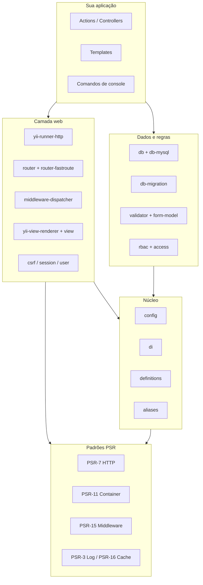

Quem vem do Yii2 costuma procurar o `Yii::$app` logo no primeiro dia de Yii3. Ele não existe. E essa ausência resume bem a mudança: o Yii3 deixou de ser **um framework monolítico** e virou **uma coleção de pacotes** que você combina como quiser.

Este é o primeiro de uma série de artigos sobre como o Yii3 funciona hoje. Depois dela, vem a série **Bastidores**, mostrando como este blog foi construído com ele.

## O que mudou de verdade

| | Yii2 | Yii3 |
|---|---|---|
| Distribuição | um pacote `yiisoft/yii2` | dezenas de pacotes `yiisoft/*` |
| Acesso a serviços | `Yii::$app->db` (service locator) | injeção pelo construtor |
| HTTP | objetos próprios | PSR-7 (request/response) e PSR-15 (middleware) |
| Container | `Yii::$container` | `yiisoft/di`, compatível com PSR-11 |
| Configuração | arrays por aplicação | `yiisoft/config`, que mescla a config dos pacotes com a sua |
| Banco | ActiveRecord no núcleo | `yiisoft/db` (query builder); ActiveRecord é opcional |

A consequência prática: **você só instala o que usa**. Este blog, por exemplo, não usa ActiveRecord: trabalha direto com o query builder.

## O ecossistema em um diagrama

Os pacotes se organizam em camadas. Embaixo ficam as PSRs; em cima, o que a sua aplicação toca no dia a dia.



## As versões que este blog usa

O template oficial `yiisoft/app` já está na série **1.x**, e os pacotes principais têm versões estáveis. Este é o recorte do `composer.json` deste projeto:

```json
{
    "yiisoft/config": "^1.6",
    "yiisoft/di": "^1.4",
    "yiisoft/router": "^4.0",
    "yiisoft/router-fastroute": "^4.0",
    "yiisoft/db-mysql": "^2.0",
    "yiisoft/db-migration": "^2.1",
    "yiisoft/view": "^12.2",
    "yiisoft/yii-view-renderer": "^7.4",
    "yiisoft/form-model": "^1.1",
    "yiisoft/validator": "^2.6",
    "yiisoft/rbac": "^2.1",
    "yiisoft/user": "^2.3"
}
```

Repare que cada pacote tem **sua própria versão**. Não existe "o Yii 3.0.4": existe o router 4, o di 1.4, a view 12… Cada um evolui no seu ritmo.

## Três ideias que guiam todo o resto

### 1. Nada de estado global

Toda dependência chega pelo construtor. Uma action do Yii3 se parece com isto:

```php
final readonly class Action
{
    public function __construct(
        private WebViewRenderer $viewRenderer,
        private PostRepository $posts,
    ) {}

    public function __invoke(): ResponseInterface
    {
        return $this->viewRenderer->render(__DIR__ . '/template', [
            'posts' => $this->posts->latestPublished(6),
        ]);
    }
}
```

Sem `Yii::$app`, sem singletons escondidos. Para testar, você instancia a classe passando o que quiser.

### 2. PSR como contrato

Request e response são PSR-7, middlewares são PSR-15 e o container é PSR-11. Isso significa que **qualquer middleware PSR-15 do ecossistema PHP funciona no Yii3**, e o contrário também.

### 3. Configuração explícita

Nada é "mágico": cada serviço vem de uma definição de DI, cada rota de um arquivo de rotas, cada middleware de uma lista. Dá mais trabalho no começo, mas você sempre sabe de onde as coisas vêm.

## Quando escolher o Yii3?

- **Escolha** se você gosta de código explícito, quer usar PSRs e prefere montar a stack peça por peça.
- **Pense duas vezes** se precisa de um ecossistema enorme de pacotes prontos ou se o time está acostumado a convenções implícitas (como no Laravel).

Nos próximos artigos, vou abrir cada camada: o caminho de uma requisição, configuração e DI, rotas e middlewares, e por fim dados, formulários e views.
