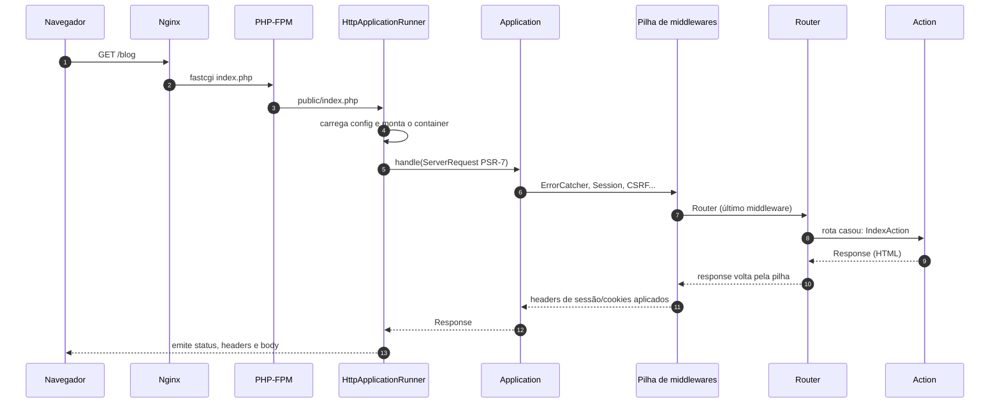
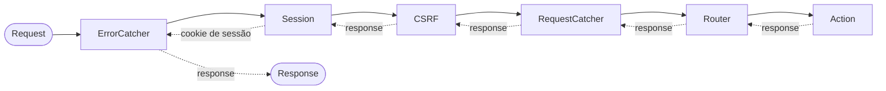

Entender o caminho de uma requisição é o atalho mais rápido para entender um framework. No Yii3 esse caminho é curto e, melhor ainda, **totalmente visível na configuração**: não há etapas escondidas.

## Visão geral



## 1. O ponto de entrada: `public/index.php`

O Nginx manda tudo o que não é arquivo físico para o `index.php`:

```nginx
location / {
    try_files $uri $uri/ /index.php$is_args$args;
}
```

E o `index.php` faz pouquíssima coisa: carrega o autoload e entrega o controle para o **runner**.

```php
$runner = new HttpApplicationRunner(
    rootPath: $root,
    debug: Environment::appDebug(),
    checkEvents: Environment::appDebug(),
    environment: Environment::appEnv(),
);
$runner->run();
```

## 2. O runner monta o mundo

O `HttpApplicationRunner` (pacote `yiisoft/yii-runner-http`) é o "main" da aplicação web. Ele:

1. lê a configuração mesclada (`yiisoft/config`) para o ambiente atual (`dev`, `prod`...);
2. cria o **container de DI** com os grupos `di` + `di-web`;
3. roda os *bootstrap callbacks*;
4. cria o `ServerRequest` PSR-7 a partir das superglobais;
5. pede a `Application` ao container e chama `handle()`;
6. **emite** a resposta (status, headers e corpo).

Ou seja: o runner é o único lugar que conhece as superglobais. Daí para frente, tudo é objeto PSR-7.

## 3. A pilha de middlewares

A `Application` não faz nada sozinha: ela delega para um `MiddlewareDispatcher`. A lista de middlewares globais fica na configuração. Neste blog, em `config/web/di/application.php`:

```php
Application::class => [
    '__construct()' => [
        'dispatcher' => DynamicReference::to([
            'class' => MiddlewareDispatcher::class,
            'withMiddlewares()' => [[
                ErrorCatcher::class,             // transforma exceções em páginas/JSON de erro
                SessionMiddleware::class,        // abre e grava a sessão
                CsrfMiddleware::class,           // valida token CSRF (exceto na API)
                RequestCatcherMiddleware::class, // disponibiliza o request atual
                Router::class,                   // encontra a rota e executa a action
            ]],
        ]),
        'fallbackHandler' => Reference::to(NotFoundHandler::class),
    ],
],
```

A ordem importa. O `ErrorCatcher` vem primeiro porque precisa **envolver todos os outros**: se qualquer camada lançar uma exceção, é ele quem a captura.



Cada middleware recebe o request, pode **parar a cadeia** (o CSRF responde 422 sem chamar o próximo) ou **chamar o próximo** e depois mexer na resposta que volta.

## 4. O roteador

O `Router` é só mais um middleware: o último da pilha global. Ele consulta a coleção de rotas (`config/common/routes.php`) e, se uma rota casar:

- grava a rota encontrada em `CurrentRoute` (de onde as actions leem argumentos como `{slug}`);
- executa os **middlewares da rota/grupo** (ex.: exigir login);
- executa a action.

Se nenhuma rota casar, o fluxo cai no `fallbackHandler`, o `NotFoundHandler`, que renderiza o 404.

## 5. A action

A action é uma classe comum, criada pelo container com todas as dependências:

```php
final readonly class PostAction
{
    public function __construct(
        private WebViewRenderer $viewRenderer,
        private PostRepository $posts,
        private CurrentRoute $currentRoute,
        private NotFoundHandler $notFound,
    ) {}

    public function __invoke(ServerRequestInterface $request): ResponseInterface
    {
        $post = $this->posts->findPublishedBySlug((string) $this->currentRoute->getArgument('slug'));
        if ($post === null) {
            return $this->notFound->handle($request);
        }
        return $this->viewRenderer->render(__DIR__ . '/post', ['post' => $post]);
    }
}
```

Ela **retorna** uma resposta PSR-7, nunca imprime nada nem chama `exit`. Isso torna o fluxo previsível e testável: em um teste, você chama a action e inspeciona o objeto devolvido.

## Resumo

- **Runner**: ponte entre o PHP "cru" e o mundo PSR-7.
- **Container**: cria tudo com injeção de dependência.
- **Middlewares**: camadas em volta da action, em ordem explícita.
- **Router**: também é um middleware.
- **Action**: recebe dependências e devolve uma `ResponseInterface`.

No próximo artigo, vamos ver de onde vem a configuração que alimenta tudo isso: `yiisoft/config` e `yiisoft/di`.
