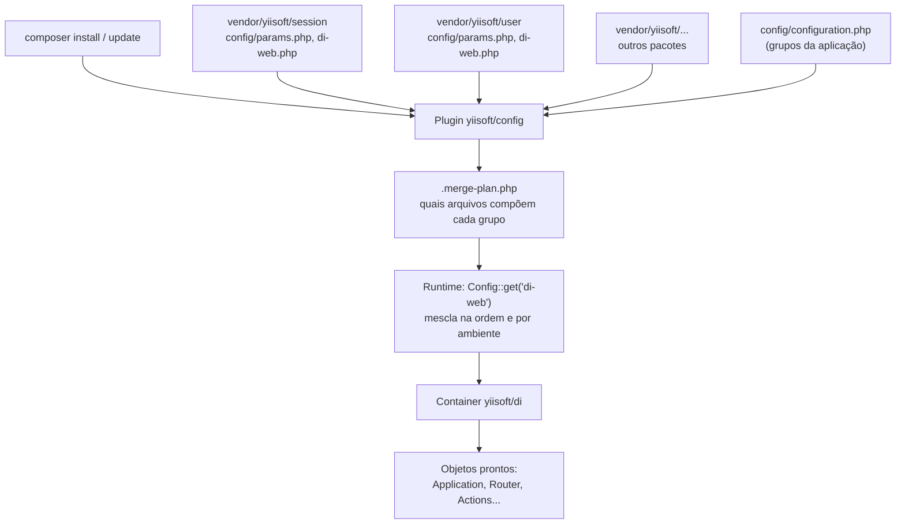
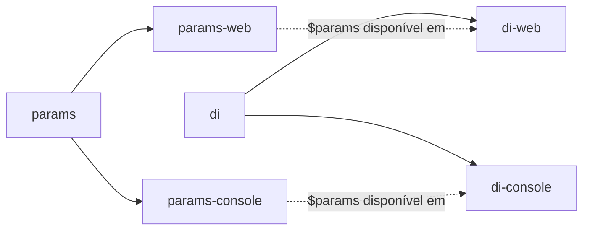
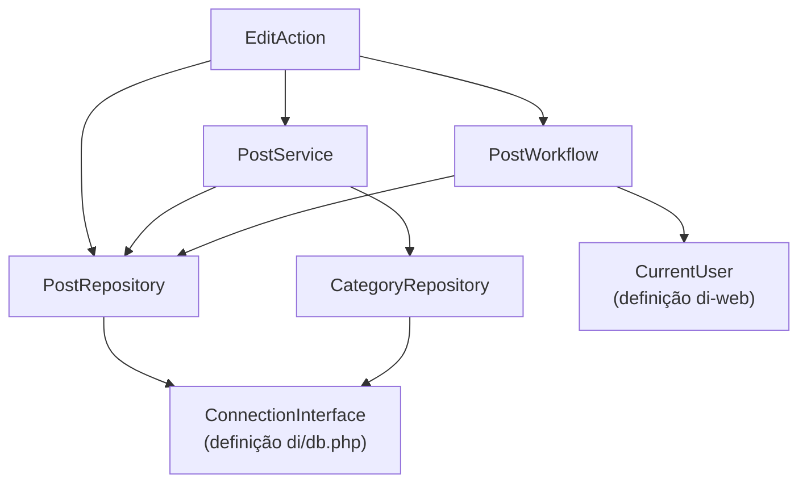

No Yii3, cada pacote traz a **própria configuração**: o `yiisoft/session` já sabe registrar a sessão, o `yiisoft/user` já sabe criar o `CurrentUser`... Você só sobrescreve o que precisa. Quem faz essa mágica (que de mágica não tem nada) é o par `yiisoft/config` + `yiisoft/di`.

## O fluxo completo



1. Cada pacote declara no `composer.json` quais arquivos fazem parte de quais **grupos**.
2. No `composer install`, o plugin gera o `config/.merge-plan.php`: um mapa de "grupo → lista de arquivos".
3. Em tempo de execução, `Config::get('di-web')` lê e mescla esses arquivos na ordem certa.
4. O resultado vira as definições do container.

## Grupos

O arquivo `config/configuration.php` deste blog define os grupos da aplicação:

```php
return [
    'config-plugin' => [
        'params' => 'common/params.php',
        'params-web' => ['$params', 'web/params.php'],
        'params-console' => ['$params', 'console/params.php'],
        'di' => 'common/di/*.php',
        'di-web' => ['$di', 'web/di/*.php'],
        'di-console' => '$di',
        'routes' => 'common/routes.php',
        'bootstrap' => 'common/bootstrap.php',
    ],
    'config-plugin-environments' => [
        'dev' => ['params' => ['environments/dev/params.php']],
        'prod' => ['params' => ['environments/prod/params.php']],
    ],
];
```

Dois detalhes importantes:

- **`$di` dentro de `di-web`** significa "comece pelo grupo `di` e acrescente estes arquivos". É assim que a web herda tudo o que é comum e adiciona o que é só dela (sessão, CSRF, usuário logado).
- **Ambientes** sobrepõem grupos: em `dev`, `environments/dev/params.php` entra por último e ganha.



## Params: os valores configuráveis

`params` são arrays simples. Os pacotes leem o que precisam:

```php
// config/web/params.php
return [
    'yiisoft/user' => [
        'authUrl' => '/admin/login',
    ],
    'yiisoft/session' => [
        'session' => [
            'options' => ['name' => 'miniblog_session', 'cookie_httponly' => 1, 'cookie_samesite' => 'Lax'],
        ],
    ],
];
```

Os arquivos de DI recebem a variável `$params` já mesclada, então uma definição pode usar `$params['yiisoft/user']['authUrl']`.

## Definições de DI

O `yiisoft/di` entende alguns formatos. Os mais usados neste blog:

### Apontar uma interface para uma classe

```php
// config/common/di/user.php
return [
    IdentityRepositoryInterface::class => UserRepository::class,
];
```

### Configurar construtor e métodos

```php
// config/common/di/db.php (resumido)
return [
    ConnectionInterface::class => [
        'class' => Connection::class,
        '__construct()' => [
            'driver' => new Driver(
                new Dsn(host: Environment::dbHost(), databaseName: Environment::dbName(), port: '3306'),
                Environment::dbUser(),
                Environment::dbPassword(),
            ),
        ],
    ],
];
```

### Chamar métodos `with*()` depois de criar

```php
// config/web/di/user.php
return [
    CurrentUser::class => [
        'withSession()' => [Reference::to(SessionInterface::class)],
        'withAccessChecker()' => [Reference::to(AccessCheckerInterface::class)],
    ],
];
```

`Reference::to()` diz: "injete aqui o serviço registrado com este ID", em vez de um valor literal.

## Autowiring: o caso mais comum

Na maior parte do tempo, **você não escreve definição nenhuma**. Se um construtor pede `PostRepository`, `PostWorkflow` e `CurrentUser`, o container resolve cada um recursivamente pelo tipo:



Só precisam de definição explícita as **interfaces** (o container não adivinha qual implementação usar) e as classes que recebem **valores escalares** (host do banco, nomes de cookie...).

## Dicas que economizam tempo

- Mudou o `configuration.php`? Rode `composer yii-config-rebuild` para regerar o merge plan.
- A raiz (sua aplicação) **sobrescreve** a configuração dos pacotes. Não precisa redeclarar tudo: o `ManagerInterface => Manager` do RBAC, por exemplo, já vem do `yiisoft/rbac`.
- Objetos criados pelo container são **compartilhados** durante a requisição (o mesmo `CurrentUser` em toda a aplicação). Isso é ótimo para serviços, mas cuidado com estado mutável.

No próximo artigo: rotas, grupos e a pilha de middlewares PSR-15.
