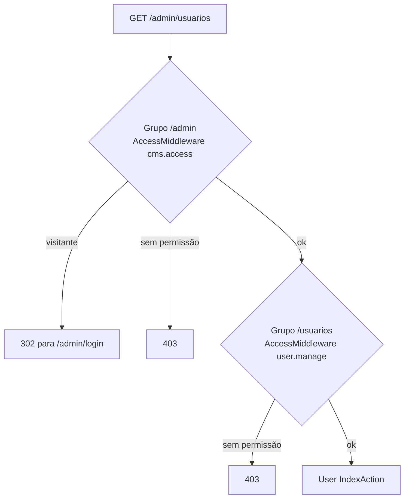
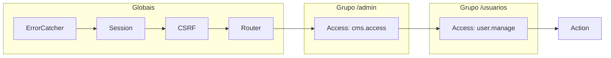

No Yii3, as rotas ficam num único arquivo PHP que retorna objetos `Route` e `Group`. Nada de anotações espalhadas pelos controllers: você abre `config/common/routes.php` e vê **o mapa inteiro da aplicação**.

## Rotas simples

```php
use Yiisoft\Router\Route;

return [
    Route::get('/')->action(Site\Landing\Action::class)->name('home'),
    Route::get('/blog')->action(Site\Blog\IndexAction::class)->name('blog/index'),
    Route::get('/blog/{slug}')->action(Site\Blog\PostAction::class)->name('blog/post'),
];
```

- `->action()` aceita uma classe invocável (`__invoke`) ou um par `[Controller::class, 'metodo']`.
- `->name()` permite gerar URLs sem escrever caminhos à mão:

```php
$urlGenerator->generate('blog/post', ['slug' => $post->slug]); // /blog/meu-post
```

Argumentos podem ter regex: `{id:\d+}` só casa com números, e `{transition:submit|approve|reject|unpublish}` só com esses quatro valores.

## Grupos: prefixo + middlewares compartilhados

O painel inteiro deste blog vive sob `/admin` e exige login. Em vez de repetir isso em cada rota, uso um grupo:

```php
Group::create('/admin')
    ->middleware(AccessMiddleware::permission(Permission::CMS_ACCESS))
    ->routes(
        Route::get('')->action(Admin\Dashboard\Action::class)->name('admin/dashboard'),
        Route::get('/posts')->action(Admin\Post\IndexAction::class)->name('admin/post/index'),

        Group::create('/usuarios')
            ->middleware(AccessMiddleware::permission(Permission::USER_MANAGE))
            ->routes(
                Route::get('')->action(Admin\User\IndexAction::class)->name('admin/user/index'),
                // ...
            ),
    ),
```

Grupos podem ser **aninhados**: `/admin/usuarios` passa primeiro pela checagem de `cms.access` e depois pela de `user.manage`.



## Middleware PSR-15 na prática

Um middleware é qualquer classe que implementa `MiddlewareInterface`:

```php
final class AccessMiddleware implements MiddlewareInterface
{
    private ?string $permission = null;

    public function __construct(
        private readonly CurrentUser $currentUser,
        private readonly Redirector $redirector,
        private readonly ErrorPage $errorPage,
    ) {}

    public function withPermission(string $permission): self
    {
        $new = clone $this;
        $new->permission = $permission;
        return $new;
    }

    public function process(ServerRequestInterface $request, RequestHandlerInterface $handler): ResponseInterface
    {
        if ($this->currentUser->isGuest()) {
            return $this->redirector->toRoute('admin/login', query: ['return' => $request->getUri()->getPath()]);
        }
        if ($this->permission !== null && !$this->currentUser->can($this->permission)) {
            return $this->errorPage->forbidden();
        }
        return $handler->handle($request); // segue para o próximo da fila
    }
}
```

Duas saídas possíveis: **responder** (redirect ou 403) e encerrar a cadeia, ou **delegar** com `$handler->handle()`.

## O truque: middleware parametrizado

Como passar a permissão para o middleware se quem o instancia é o container? Com uma **definição de array**, a mesma sintaxe dos arquivos de DI:

```php
public static function permission(string $permission): array
{
    return [
        'class' => self::class,
        'withPermission()' => [$permission],
    ];
}
```

`AccessMiddleware::permission('user.manage')` devolve um array que o `MiddlewareFactory` do Yii3 entende: ele cria o objeto pelo container e chama `withPermission('user.manage')`. Assim, uma única classe atende todas as áreas do painel.

## A cebola

Juntando middlewares globais, de grupo e de rota, cada requisição atravessa camadas como uma cebola:



## Lendo argumentos da rota

Dentro da action, `CurrentRoute` entrega os argumentos já casados:

```php
public function __construct(private CurrentRoute $currentRoute, private PostRepository $posts) {}

public function __invoke(): ResponseInterface
{
    $post = $this->posts->findById((int) $this->currentRoute->getArgument('id'));
    // ...
}
```

## Boas práticas que adotei

- **Nomeie todas as rotas** e gere URLs pelo nome: renomear `/posts` para `/artigos` vira uma mudança de uma linha.
- **Proteja no grupo, refine na action.** O grupo garante "precisa estar logado"; a action decide "pode editar *este* post?".
- **Rotas de fallback por área.** Na API, uma rota coringa `/{path:.*}` no fim do grupo devolve 404 em JSON, e não a página HTML.

Próximo e último artigo da série Yii3: dados, formulários e views.
