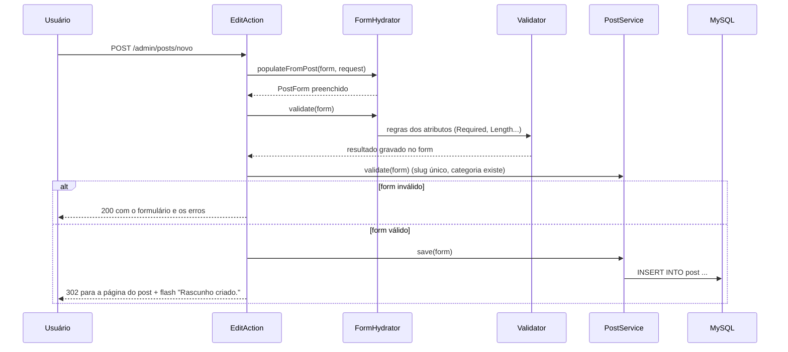
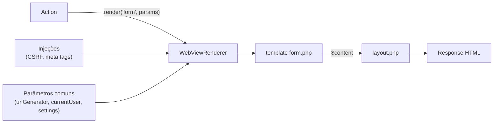

Os três artigos anteriores mostraram a "tubulação" do Yii3. Agora vamos ao que preenche as páginas: **ler e gravar dados, validar formulários e renderizar HTML**.

## O ciclo de um formulário



## FormModel: o formulário como classe

As regras ficam **na própria propriedade**, com atributos PHP 8:

```php
final class PostForm extends FormModel
{
    #[Required(message: 'Informe o título.')]
    #[Length(min: 3, max: 200, lessThanMinMessage: 'O título deve ter ao menos {min} caracteres.')]
    public string $title = '';

    #[Regex(pattern: '/^[a-z0-9]+(?:-[a-z0-9]+)*$/', message: 'Use apenas letras minúsculas, números e hífens.', skipOnEmpty: true)]
    public ?string $slug = null;

    #[Integer(min: 1, skipOnEmpty: true)]
    public ?int $categoryId = null;
}
```

O `FormHydrator` lê `$_POST['PostForm'][...]` e **converte tipos** sozinho: `"3"` vira `3` em `?int $categoryId`, e string vazia vira `null` em propriedades nulas.

```php
if ($this->formHydrator->populateFromPost($form, $request)) {
    $this->formHydrator->validate($form);
    $this->postService->validate($form, $post); // regras que precisam do banco

    if ($form->isValid()) {
        // gravar e redirecionar
    }
}
```

Uma decisão que vale explicar: chamo `populateFromPost` e `validate` **separadamente** (em vez de `populateFromPostAndValidate`) para que as regras que dependem do banco rodem **mesmo quando a validação básica falha**. Assim, o usuário vê todos os erros de uma vez.

O mesmo `PostForm` é reaproveitado pela API JSON: só muda a origem dos dados (`populate($form, $json, $map, scope: '')`).

## Banco de dados com yiisoft/db

O `yiisoft/db` oferece um **query builder** independente de ActiveRecord. Um repositório deste blog:

```php
public function publishedPage(int $page, int $perPage, ?int $categoryId = null, ?string $search = null): Paginator
{
    $query = $this->db->select(['p.*', 'author_name' => 'a.name', 'category_name' => 'c.name'])
        ->from(['p' => 'post'])
        ->innerJoin(['a' => 'user'], 'a.id = p.author_id')
        ->leftJoin(['c' => 'category'], 'c.id = p.category_id')
        ->where(['p.status' => 'published'])
        ->andFilterWhere(['p.category_id' => $categoryId]); // ignorado quando null

    if ($search) {
        $query->andWhere(['or', ['like', 'p.title', $search], ['like', 'p.content', $search]]);
    }

    $total = (clone $query)->count();
    $rows = $query->orderBy(['p.published_at' => SORT_DESC])
        ->limit($perPage)->offset(($page - 1) * $perPage)->all();

    return new Paginator(array_map(Post::fromRow(...), $rows), $total, $page, $perPage);
}
```

Tudo é parametrizado (sem SQL injection), e `andFilterWhere` elimina aquele monte de `if ($x !== null)`.

Para gravar:

```php
$this->db->createCommand()->insert('post', $data)->execute();
$this->db->createCommand()->update('post', ['views' => new Expression('views + 1')], ['id' => $id])->execute();
```

## Migrations

O `yiisoft/db-migration` registra os comandos `migrate:*` no console. Uma migration é uma classe com `up()` e `down()`:

```php
final class M260101000000CreateSchema implements RevertibleMigrationInterface
{
    public function up(MigrationBuilder $b): void
    {
        $b->createTable('category', [
            'id' => ColumnBuilder::primaryKey(),
            'name' => ColumnBuilder::string(100)->notNull(),
            'slug' => ColumnBuilder::string(120)->notNull()->unique(),
        ]);
    }

    public function down(MigrationBuilder $b): void
    {
        $b->dropTable('category');
    }
}
```

```bash
./yii migrate:create create_tag_table
./yii migrate:up
./yii migrate:down 1
```

## Views: WebViewRenderer, layouts e injeções

A action pede para renderizar um template PHP e recebe uma `ResponseInterface`:

```php
return $this->viewRenderer
    ->withLayout('@src/Web/Shared/Layout/Admin/layout.php')
    ->render(__DIR__ . '/form', ['form' => $form, 'post' => $post]);
```



- **Parâmetros comuns** (configurados em `params`) ficam disponíveis em todo template: aqui uso `urlGenerator`, `currentUser`, `flash` e `settings`.
- **Injeções** acrescentam variáveis e meta tags automaticamente. A `CsrfViewInjection` é o que coloca `$csrf` à disposição de todo formulário:

```php
<form method="post">
    <?= $csrf->hiddenInput() ?>
    ...
</form>
```

- Os templates são **PHP puro**. Sempre escape com `Html::encode()`. O Yii3 não faz isso por você.

## Fechando a série

Com estes cinco artigos, você tem o mapa do Yii3: pacotes, caminho da requisição, configuração e DI, rotas e middlewares, e agora dados, formulários e views.

A partir do próximo post começa a série **Bastidores**, em que mostro como juntei todas essas peças para construir este blog: Docker, banco, RBAC, painel, API e até um app PWA.
