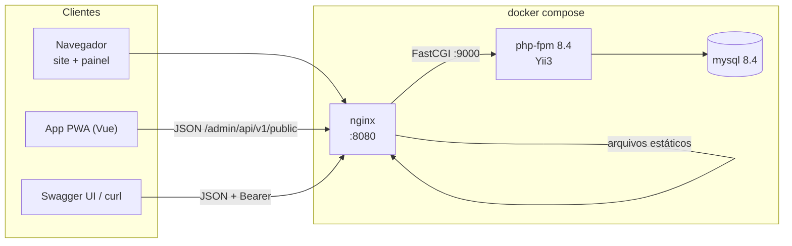
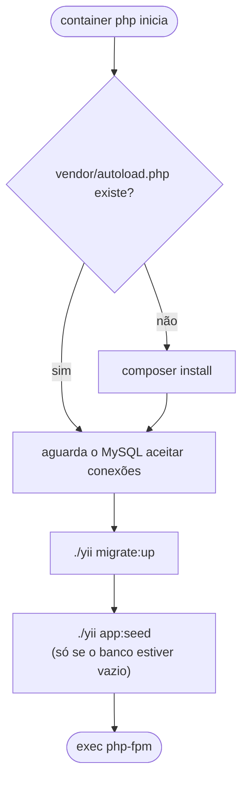

Este blog é o meu laboratório de Yii3. Nesta série, mostro **como ele foi construído**: as decisões, o código e os tropeços. Tudo o que aparece aqui está no repositório [personal-blog-yii3](https://github.com/yurineves92/personal-blog-yii3).

O que o projeto tem:

- **site público**: landing page e blog com busca, categorias e Markdown;
- **painel CMS** com três papéis (admin, revisor e editor) e fluxo editorial;
- **API REST** documentada com Swagger;
- um **app PWA em Vue** só para leitura, consumindo a API.

## A arquitetura em um diagrama



Três containers, cada um com uma responsabilidade:

| Serviço | Imagem | Papel |
|---|---|---|
| `nginx` | `nginx:1.27-alpine` | serve `public/` (CSS, JS, favicon) e repassa o resto ao PHP |
| `php` | build próprio (`php:8.4-fpm-alpine`) | roda o Yii3 |
| `mysql` | `mysql:8.4` | banco, com volume persistente |

## Por que trocar o FrankenPHP por Nginx + PHP-FPM

O template oficial `yiisoft/app` vem com **FrankenPHP** (Caddy + PHP num binário só). É ótimo, mas eu queria a stack que mais encontro em produção: **Nginx na frente, PHP-FPM atrás**. A configuração do Nginx ficou enxuta:

```nginx
server {
    listen 80 default_server;
    root /app/public;

    location / {
        try_files $uri $uri/ /index.php$is_args$args;
    }

    location ~ \.php$ {
        try_files /index.php =404;
        fastcgi_pass php:9000;
        include fastcgi_params;
        fastcgi_param SCRIPT_FILENAME $document_root/index.php;
    }
}
```

O `try_files` faz o Nginx entregar direto os arquivos que existem e mandar todo o resto para o `index.php`, onde o roteador do Yii3 assume.

## A imagem PHP

```dockerfile
FROM php:8.4-fpm-alpine

COPY --from=mlocati/php-extension-installer /usr/bin/install-php-extensions /usr/local/bin/
RUN install-php-extensions pdo_mysql intl opcache zip

COPY --from=composer:2 /usr/bin/composer /usr/bin/composer
COPY docker/php/entrypoint.sh /usr/local/bin/app-entrypoint

ENTRYPOINT ["app-entrypoint"]
CMD ["php-fpm"]
```

O `install-php-extensions` poupa o trabalho de instalar dependências de sistema de cada extensão. `intl` é usada para datas em português e para gerar slugs (`Transliterator`).

## Um `docker compose up` e pronto

Eu queria que qualquer pessoa clonasse o repositório e tivesse o blog funcionando com **um comando**. Quem faz isso é o entrypoint do container PHP:



```sh
if [ "$1" = "php-fpm" ]; then
    [ -f vendor/autoload.php ] || composer install --no-interaction --prefer-dist
    until php -r 'new PDO(...);' 2>/dev/null; do sleep 2; done
    ./yii migrate:up --no-interaction
    ./yii app:seed
fi
exec "$@"
```

Dois detalhes:

- O `if [ "$1" = "php-fpm" ]` evita rodar migrations quando executo comandos avulsos, como `docker compose exec php ./yii ...`.
- O `docker-compose.yml` tem um `healthcheck` no MySQL, e o PHP só sobe com `depends_on: condition: service_healthy`. O loop de espera é uma segunda garantia.

## O problema de performance (e a solução)

Na primeira versão, **cada página levava cerca de 2 segundos**. O culpado: no Windows (e no macOS), o Docker acessa a pasta do projeto por um *bind mount* lento, e uma requisição do Yii3 carrega uns 490 arquivos PHP, quase todos em `vendor/`.

Medi dentro do container:

```text
total 4755ms files=489   (sem opcache)
```

A solução foi colocar o `vendor/` num **volume nomeado** do Docker, que fica no sistema de arquivos do Linux:

```yaml
php:
  volumes:
    - ./:/app            # código da aplicação: editável no host
    - vendor:/app/vendor # dependências: rápido, dentro do Docker
```

Resultado: **de ~2 s para ~160 ms** por página. O código em `src/` continua montado do host, então editar um arquivo reflete na hora. O preço é que, para a IDE enxergar o `vendor/`, preciso rodar `composer install` também no host.

## Estrutura de pastas

```text
config/            configuração Yii3 (rotas, DI, params por ambiente)
docker/            Dockerfile, entrypoint e config do Nginx
assets/            CSS/JS do site e do painel (publicados em public/assets)
seed/posts/        os artigos que você está lendo, em Markdown
src/
  Api/             tokens da API
  Auth/Rbac/       papéis, permissões e regras
  Blog/            Post, Category, repositórios, PostService e PostWorkflow
  Console/         comandos app:seed e user:create
  Migration/       migrations
  Web/Site/        landing page e blog público
  Web/Admin/       painel CMS
  Web/Api/         API REST (controllers + OpenAPI)
```

Dentro de `Web/`, cada funcionalidade tem a própria pasta com a **action** e o **template** lado a lado (ex.: `Web/Admin/Post/EditAction.php` + `form.php`). É o padrão do template oficial, e funciona muito bem: tudo de uma tela fica junto.

No próximo episódio: o modelo de dados, os repositórios e por que não usei ActiveRecord.
