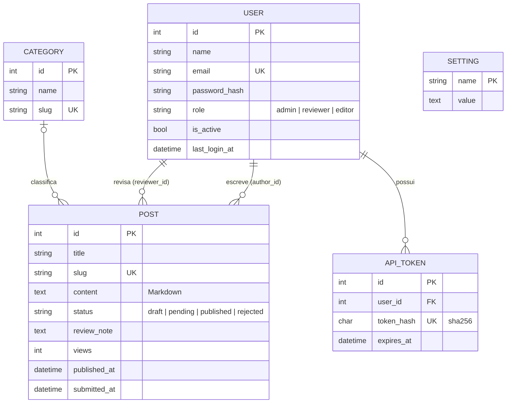
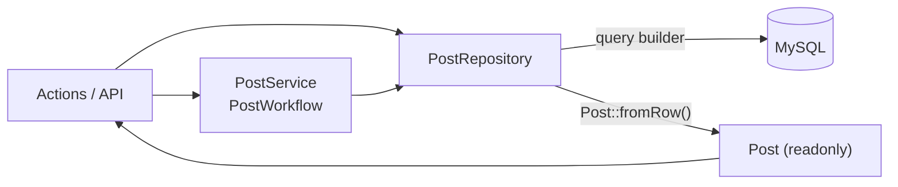

Neste episódio, desço até o banco: as tabelas, como elas viram objetos PHP e por que escolhi **repositórios com query builder** em vez de ActiveRecord.

## O modelo de dados



Algumas decisões:

- **`role` é uma coluna em `user`**, e não uma tabela de atribuições. Cada pessoa tem exatamente um papel; o próximo episódio mostra como isso conversa com o RBAC.
- **Chaves estrangeiras com intenção**: apagar uma categoria faz `SET NULL` nos posts (eles ficam "sem categoria"), enquanto apagar um autor com posts é bloqueado (`RESTRICT`).
- **`setting`** é uma tabela chave/valor com os textos da landing page (título, "sobre", projetos do GitHub...), editáveis no painel.

## Migrations com ColumnBuilder

```php
$b->createTable('post', [
    'id' => ColumnBuilder::primaryKey(),
    'title' => ColumnBuilder::string(200)->notNull(),
    'slug' => ColumnBuilder::string(220)->notNull()->unique(),
    'content' => ColumnBuilder::text()->notNull(),
    'category_id' => ColumnBuilder::integer()->null(),
    'author_id' => ColumnBuilder::integer()->notNull(),
    'status' => ColumnBuilder::string(20)->notNull()->defaultValue('draft'),
    'views' => ColumnBuilder::integer()->notNull()->defaultValue(0),
    'published_at' => ColumnBuilder::datetime()->null(),
    // ...
], 'ENGINE=InnoDB DEFAULT CHARSET=utf8mb4 COLLATE=utf8mb4_unicode_ci');

$b->createIndex('post', 'idx-post-status-published_at', ['status', 'published_at']);
$b->addForeignKey('post', 'fk-post-category', 'category_id', 'category', 'id', 'SET NULL', 'CASCADE');
```

O índice composto `(status, published_at)` atende a consulta mais frequente do site: "posts publicados, do mais novo para o mais antigo".

## Por que repositórios e não ActiveRecord?

O Yii3 tem um pacote de ActiveRecord, mas ele é **opcional**. Para um projeto deste tamanho, preferi separar bem as responsabilidades:



- O **repositório** é o único que fala SQL.
- A **entidade** é um objeto imutável, sem acesso ao banco.
- As **regras** (quem pode publicar, quais transições existem) ficam em serviços.

Assim, um template nunca dispara uma consulta escondida (o famoso N+1 do `$post->author->name`): o repositório já traz o nome do autor e da categoria num `JOIN`.

## A entidade: `final readonly class`

```php
final readonly class Post
{
    public function __construct(
        public int $id,
        public string $title,
        public string $slug,
        public string $content,
        public ?int $categoryId,
        public ?string $categoryName,
        public int $authorId,
        public string $authorName,
        public PostStatus $status,
        public ?DateTimeImmutable $publishedAt,
        // ...
    ) {}

    public static function fromRow(array $row): self
    {
        return new self(
            id: (int) $row['id'],
            title: (string) $row['title'],
            status: PostStatus::from((string) $row['status']),
            publishedAt: $row['published_at'] !== null ? new DateTimeImmutable($row['published_at']) : null,
            // ...
        );
    }
}
```

`readonly` garante que ninguém altere um post "sem querer" no meio do caminho. Para mudar algo, só pelo repositório.

## O status como enum

```php
enum PostStatus: string
{
    case Draft = 'draft';
    case Pending = 'pending';
    case Published = 'published';
    case Rejected = 'rejected';

    public function label(): string
    {
        return match ($this) {
            self::Draft => 'Rascunho',
            self::Pending => 'Em revisão',
            self::Published => 'Publicado',
            self::Rejected => 'Rejeitado',
        };
    }

    public function isEditableByAuthor(): bool
    {
        return $this === self::Draft || $this === self::Rejected;
    }
}
```

O banco guarda a string, o PHP trabalha com o enum, e o `match` garante que nenhum status fique sem rótulo.

## Utilidades pequenas, mas úteis

**Slugs com transliteração**: “Configuração e DI” vira `configuracao-e-di`.

```php
$transliterator = Transliterator::create('Any-Latin; Latin-ASCII; Lower()');
$slug = trim(preg_replace('/[^a-z0-9]+/', '-', $transliterator->transliterate($text)), '-');
```

**Slug único**: se já existe, acrescenta `-2`, `-3`...

```php
Slugger::unique($form->title, fn(string $slug) => $this->posts->slugExists($slug, $post?->id));
```

**Paginação** num objeto simples, `Paginator`, com `items`, `total`, `page`, `pageCount` e um `pages()` que já calcula as reticências da navegação (`1 … 4 5 6 … 12`).

## Seed a partir de Markdown

Os artigos que você lê aqui ficam em `seed/posts/*.md`, com um front matter simples:

```markdown
---
title: Bastidores #2: domínio, banco e repositórios
category: Bastidores
days_ago: 9
---
Conteúdo em **Markdown**...
```

O comando `./yii app:seed --fresh` apaga o banco e recria o autor, as categorias e os artigos. Assim, o conteúdo inicial do blog também é **versionado no Git**.

No próximo episódio: autenticação, RBAC e o fluxo editorial.
