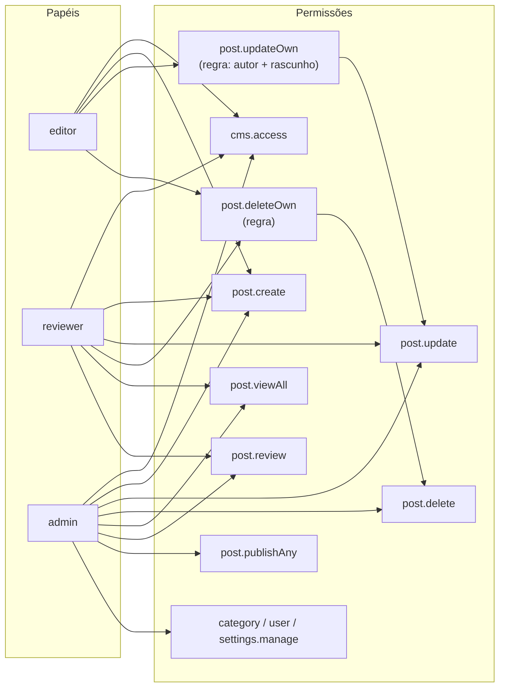
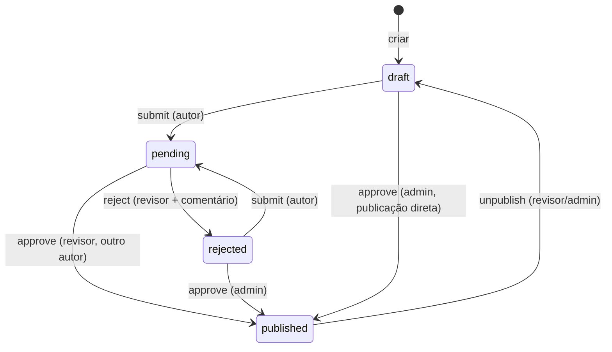

Hoje eu sou o único autor deste blog, mas o painel foi feito para uma equipe: **admin, revisor e editor**, com um fluxo editorial em que nada vai ao ar sem revisão. Este episódio mostra como isso foi montado.

## Autenticação

O `yiisoft/user` traz o `CurrentUser`, que guarda o ID do usuário na sessão. A aplicação só precisa dizer **como achar um usuário pelo ID**:

```php
final readonly class UserRepository implements IdentityRepositoryInterface
{
    public function findIdentity(string $id): ?User
    {
        $user = $this->findById((int) $id);
        return $user !== null && $user->isActive ? $user : null; // conta desativada = deslogada
    }
}
```

O login valida a senha com `PasswordHasher` (bcrypt/argon por baixo) e chama `$currentUser->login($user)`, que também regenera o ID da sessão.

Um cuidado de segurança: o login aceita um `?return=` para voltar à página de origem, mas **só para caminhos internos do painel**, para evitar *open redirect*:

```php
if (str_starts_with($return, '/admin') && !str_starts_with($return, '//')) {
    return $return;
}
return '/admin';
```

## Papéis e permissões



A hierarquia fica **em código**, numa classe que estende o `SimpleItemsStorage` do `yiisoft/rbac`:

```php
final class RbacItemsStorage extends SimpleItemsStorage
{
    private const ROLE_PERMISSIONS = [
        'editor' => [Permission::CMS_ACCESS, Permission::POST_CREATE, Permission::POST_UPDATE_OWN, Permission::POST_DELETE_OWN],
        'reviewer' => [/* ... */ Permission::POST_UPDATE, Permission::POST_VIEW_ALL, Permission::POST_REVIEW],
        'admin' => [/* tudo */],
    ];

    public function __construct()
    {
        // cria as permissões e os papéis
        $this->addChild(Permission::POST_UPDATE_OWN, Permission::POST_UPDATE);
        // ...
    }
}
```

Por que em código e não no banco? Porque permissões **mudam junto com o código**: uma permissão nova sempre vem acompanhada da tela que a usa. Versionar tudo junto evita banco e código fora de sincronia.

### De onde vem o papel de cada usuário

O RBAC pergunta a um `AssignmentsStorage` quais papéis o usuário tem. Escrevi um que lê a coluna `user.role`:

```php
final class UserRoleAssignmentsStorage extends SimpleAssignmentsStorage
{
    public function getByUserId(string $userId): array
    {
        // carrega sob demanda: SELECT id, role FROM user WHERE id = ? AND is_active = 1
        // e devolve [role => Assignment]
    }
}
```

## A regra "só o autor, só enquanto é rascunho"

O padrão clássico do Yii: o editor não tem `post.update`; tem `post.updateOwn`, que é **pai** de `post.update` e carrega uma regra.

```php
final class OwnEditablePostRule implements RuleInterface
{
    public function execute(?string $userId, Item $item, RuleContext $context): bool
    {
        $post = $context->getParameterValue('post');

        return $post instanceof Post
            && (string) $post->authorId === $userId
            && $post->status->isEditableByAuthor(); // rascunho ou rejeitado
    }
}
```

Com isso, **a mesma pergunta** serve para todos os papéis:

```php
$currentUser->can('post.update', ['post' => $post]);
// admin/revisor: true (têm post.update direto)
// editor: true só se for o autor e o post estiver em rascunho/rejeitado
```

E os templates usam a mesma chamada para esconder o botão "Editar". A regra fica em **um único lugar**.

### Uma armadilha que encontrei

Minha primeira ideia foi fazer `admin → reviewer → editor` (cada papel herdando o anterior). O problema: o revisor passaria a alcançar `post.update` por **dois caminhos**, um direto e outro via `post.updateOwn` (com regra). Ao montar a hierarquia, o storage guarda os filhos de cada caminho, e dependendo da ordem a regra do editor podia ser avaliada para o revisor, negando acesso. A solução foi deixar os papéis **planos**, cada um com a lista explícita de permissões. Fica mais verboso, mas sem ambiguidade.

## O fluxo editorial como máquina de estados



Quem conhece as transições é o `PostWorkflow`. Ele combina **permissões do RBAC** com **condições de estado**:

```php
public function canApprove(Post $post): bool
{
    if ($post->status === PostStatus::Published) {
        return false;
    }
    if ($this->currentUser->can(Permission::POST_PUBLISH_ANY)) {
        return true; // admin publica direto
    }
    return $post->status === PostStatus::Pending
        && $this->currentUser->can(Permission::POST_REVIEW)
        && !$this->isAuthor($post); // revisor não aprova o próprio texto
}
```

E `apply()` executa a transição, ou lança `DomainException`:

```php
$message = $this->workflow->apply('reject', $post, note: 'Faltou um exemplo de código.');
```

O painel transforma a exceção em mensagem de erro; a API, em `409 Conflict`. **Mesma regra, duas interfaces.**

## Protegendo as rotas

Por fim, o `AccessMiddleware` (detalhado no artigo sobre rotas) protege áreas inteiras, e as actions fazem a checagem fina por post:

```php
Group::create('/admin')
    ->middleware(AccessMiddleware::permission(Permission::CMS_ACCESS))
    ->routes(/* ... */);
```

```php
if (!$this->workflow->canEdit($post)) {
    return $this->errorPage->forbidden('Este post está em revisão e não pode ser editado pelo autor agora.');
}
```

No próximo episódio: o site público e o painel, com views, Markdown seguro, diagramas e as lições de responsividade.
