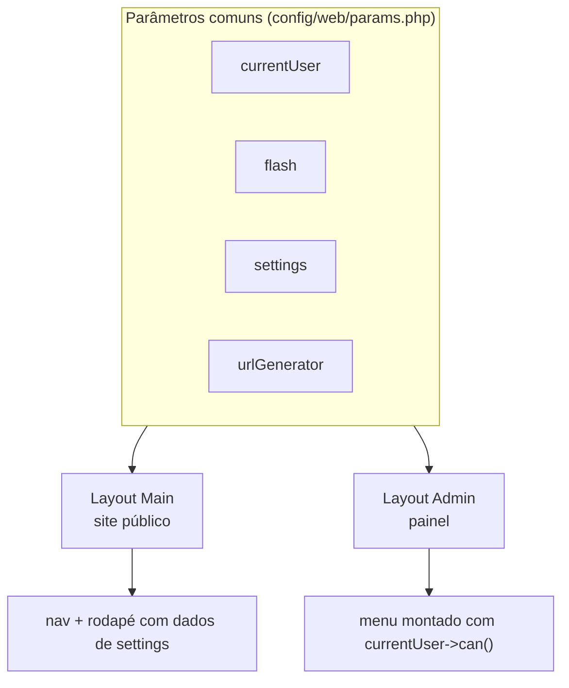
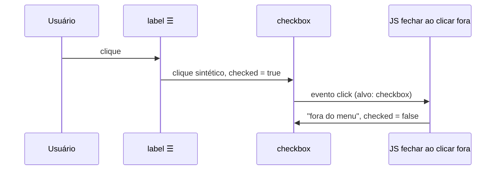

Com a arquitetura, o banco e as permissões prontos, faltava o que você está vendo agora: **as telas**. Este episódio cobre o site público e o painel CMS.

## Uma pasta por tela

Cada tela tem uma pasta com a action e o template lado a lado:

```text
src/Web/
  Site/
    Landing/      Action.php + template.php
    Blog/         IndexAction.php + index.php, PostAction.php + post.php
    Shared/       post-card.php, ícones
  Admin/
    Dashboard/    Action.php + template.php
    Post/         IndexAction, EditAction, ViewAction, TransitionAction... + templates
    Category/ User/ Settings/ Profile/ Api/
  Shared/
    Layout/Main/  layout do site
    Layout/Admin/ layout do painel
```

A action renderiza um template **relativo a ela mesma**, o que deixa tudo muito fácil de achar:

```php
return $this->viewRenderer
    ->withLayout(AdminLayout::PATH)
    ->render(__DIR__ . '/form', ['form' => $form, 'post' => $post]);
```

Um aprendizado: dentro de um template, `$this->render()` **não resolve aliases** como `@src/...`. Para partials compartilhados, uso caminhos relativos ao template atual: `$this->render('../Shared/post-card.php', [...])`.

## Dois layouts, um único conjunto de dados



O menu do painel é montado conforme as permissões: o editor nem vê "Usuários" ou "Configurações". A fila de revisão mostra um contador de pendentes:

```php
if ($currentUser->can(Permission::POST_REVIEW)) {
    $pending = $postRepository->countByStatus()['pending'];
    $menu[] = ['Fila de revisão', 'admin/review', '✓', $active, $pending ?: null];
}
```

## Formulários sem framework de componentes

Os formulários usam `FormModel` (validação por atributos) e um helper pequeno, o `FormView`, que só gera nomes de campo, valores escapados e mensagens de erro:

```php
<?php $f = new FormView($form); ?>
<div class="<?= $f->fieldClass('title') ?>">
    <label for="title">Título</label>
    <input id="title" name="<?= $f->name('title') ?>" value="<?= $f->value('title') ?>">
    <?= $f->errorTag('title') ?>
</div>
```

Depois de gravar, a action redireciona com uma **mensagem flash** (padrão *Post/Redirect/Get*), evitando o reenvio do formulário ao atualizar a página:

```php
return $this->redirector->withFlash('success', 'Post aprovado e publicado.', 'admin/post/view', ['id' => $post->id]);
```

## Markdown seguro

Os posts são escritos em Markdown e convertidos com o `league/commonmark` (sabor GitHub). Como o conteúdo vira HTML, a configuração de segurança é obrigatória:

```php
new GithubFlavoredMarkdownConverter([
    'html_input' => 'escape',          // HTML digitado no post é exibido como texto
    'allow_unsafe_links' => false,     // nada de [clique](javascript:...)
]);
```

## Diagramas Mermaid

Os diagramas destes artigos são blocos ` ```mermaid ` comuns. O CommonMark gera `<pre><code class="language-mermaid">`, e um script pequeno os transforma em SVG. A biblioteca **só é baixada se a página tiver algum diagrama**:

```js
const blocks = document.querySelectorAll('pre > code.language-mermaid');
if (blocks.length) {
    const { default: mermaid } = await import('https://cdn.jsdelivr.net/npm/mermaid@11/dist/mermaid.esm.min.mjs');
    blocks.forEach((code) => {
        const div = document.createElement('div');
        div.className = 'mermaid';
        div.textContent = code.textContent;
        code.parentElement.replaceWith(div);
    });
    mermaid.initialize({ startOnLoad: false, securityLevel: 'strict' });
    await mermaid.run({ querySelector: '.mermaid' });
}
```

Sem JavaScript, o leitor ainda vê o código do diagrama, que é legível por si só.

## Assets

CSS e JS ficam em `assets/` e são publicados pelo `AssetManager` do Yii3 em `public/assets/<hash>/`. O hash muda quando os arquivos mudam, então o cache do navegador nunca serve um CSS velho:

```php
final class AdminAsset extends AssetBundle
{
    public ?string $sourcePath = '@assetsSource/admin';
    public ?string $basePath = '@assets/admin';
    public ?string $baseUrl = '@assetsUrl/admin';
    public array $css = ['admin.css'];
    public array $js = [['admin.js', 'defer' => true]];
}
```

## Lições de responsividade

Testei cada página em 375 px e 768 px, medindo `scrollWidth` com um navegador headless. Três problemas apareceram:

1. **Grid com conteúdo largo**: `grid-template-columns: 1fr` não encolhe abaixo do conteúdo mínimo (um bloco de código, por exemplo). A correção é `minmax(0, 1fr)`.
2. **Input em flex**: `<input>` tem largura mínima intrínseca; numa linha com botão, o botão saía da tela. `min-width: 0` resolveu.
3. **Tabelas**: no celular, colunas secundárias (autor, leituras, data) ganham a classe `hide-sm`.

### O bug do menu que não abria

O menu lateral do painel no celular é um checkbox escondido + um `<label>` (☰). Eu também tinha um JS que **fechava o menu ao clicar fora**. Resultado: o menu não abria nunca.



O clique no `<label>` gera um **segundo clique sintético** no checkbox, e o meu código entendia esse clique como "fora do menu". A solução final dispensou o JS: um segundo `<label for="sidebar-toggle">` como fundo escurecido. Tocar nele fecha o menu, só com CSS.

No último episódio: a API REST, o Swagger e o app PWA em Vue.
