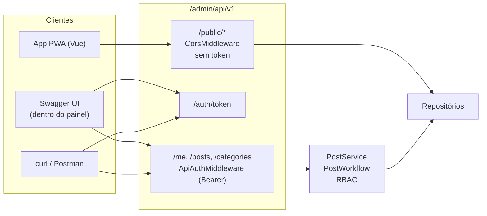
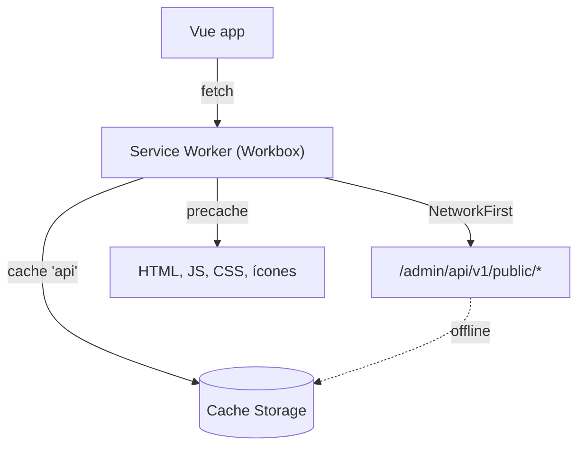

Último episódio da série. O blog ganhou uma **API REST**, e a API ganhou um cliente: um **app PWA em Vue** para ler os artigos, inclusive offline.

## Visão geral



## Por que "dentro do admin"?

A API vive em `/admin/api/v1` porque ela é, essencialmente, **o painel sem HTML**: as mesmas permissões, as mesmas regras de fluxo editorial, os mesmos serviços. Uma decisão importante para isso funcionar foi extrair o `PostService`, compartilhado pela `EditAction` do painel e pelo `PostController` da API.

## Tokens Bearer (sem JWT)

Para uma API que serve o próprio painel, JWT seria complexidade sem ganho. Usei **tokens opacos**:

```php
$token = 'mb_' . bin2hex(random_bytes(32));          // 256 bits de entropia
$this->db->createCommand()->insert('api_token', [
    'user_id' => $userId,
    'token_hash' => hash('sha256', $token),          // o banco só guarda o hash
    'expires_at' => date('Y-m-d H:i:s', strtotime('+30 days')),
])->execute();

return $token;                                       // exibido uma única vez
```

- O **prefixo `mb_`** ajuda scanners de segredos (como o do GitHub) a reconhecer o token se ele vazar num commit.
- Se o banco vazar, os hashes não servem para nada.
- Cada token pode ser revogado individualmente na página **API** do painel.

O `ApiAuthMiddleware` valida o header e coloca o dono do token como usuário atual. A partir daí, `$currentUser->can()` e o RBAC funcionam exatamente como no painel:

```php
$userId = $this->tokens->findUserIdByToken($matches[1]);
$user = $userId !== null ? $this->users->findIdentity((string) $userId) : null;
if ($user === null) {
    return $this->responder->unauthorized();
}

$this->currentUser->overrideIdentity($user);
try {
    return $handler->handle($request);
} finally {
    $this->currentUser->clearIdentityOverride();
}
```

### E o CSRF?

O site inteiro valida token CSRF, menos a API. Isso é seguro **porque a API ignora o cookie de sessão**: ela só aceita o header `Authorization`, que um site malicioso não consegue enviar em nome do usuário. Um middleware pequeno faz a exceção:

```php
if (str_starts_with($request->getUri()->getPath(), '/admin/api/v1/')) {
    return $handler->handle($request);       // pula o CSRF
}
return $this->csrf->process($request, $handler);
```

## Erros padronizados (RFC 9457)

Todo erro da API tem o mesmo formato, `application/problem+json`:

```json
{
    "type": "about:blank",
    "title": "Unprocessable Entity",
    "status": 422,
    "detail": "Os dados enviados são inválidos.",
    "errors": {
        "title": ["O título deve ter ao menos 3 caracteres."],
        "category_id": ["Categoria inválida."]
    }
}
```

| Situação | Status |
|---|---|
| sem token / token inválido | 401 + `WWW-Authenticate: Bearer` |
| RBAC negou | 403 |
| post de outro autor (para editor) | 404, para não revelar que existe |
| validação | 422 |
| transição inválida (ex.: aprovar o próprio post) | 409 |

## Swagger com swagger-php

A especificação OpenAPI 3.1 é **gerada a partir de atributos** nos próprios controllers, então a documentação não desatualiza:

```php
#[OA\Get(
    path: '/posts/{id}',
    operationId: 'getPost',
    summary: 'Detalhar post',
    tags: ['Posts'],
    parameters: [new OA\Parameter(ref: '#/components/parameters/id')],
    responses: [
        new OA\Response(response: 200, description: 'OK', content: new OA\JsonContent(ref: '#/components/schemas/Post')),
        new OA\Response(ref: '#/components/responses/NotFound', response: 404),
    ],
)]
public function view(): ResponseInterface { /* ... */ }
```

A página **API** do painel carrega o Swagger UI apontando para `/admin/api/openapi.json`. Quando você gera um token por ela, o Swagger já fica autorizado (`ui.preauthorizeApiKey`).

**Armadilha:** coloquei vários `#[OA\Schema]` numa única classe, e nenhum foi registrado. O swagger-php espera **um schema por classe**. Separei cada um (`PostSchema`, `UserSchema`, `ProblemSchema`...) e os avisos de `$ref not found` sumiram.

## Endpoints públicos + CORS

Um app de leitura não pode carregar um token de admin. Por isso criei endpoints **públicos e somente leitura**, que só expõem conteúdo publicado:

| Endpoint | Retorna |
|---|---|
| `GET /public/site` | nome, autor, stack e projetos |
| `GET /public/posts?category=&q=&page=` | posts publicados, paginados |
| `GET /public/posts/{slug}` | post com `content_html` já renderizado |
| `GET /public/categories` | categorias com posts |

Eles respondem com `Access-Control-Allow-Origin: *`, o que é seguro aqui porque não há cookies, credenciais nem escrita.

Repare no `content_html`: o Markdown é convertido **no servidor**, com a mesma configuração segura do site. O app não precisa de parser de Markdown nem de sanitização própria.

## O app PWA em Vue

O app fica em um diretório separado (`blog-yii3-pwa`), feito com **Vite + Vue 3 + Vue Router + vite-plugin-pwa**:



- **Shell pré-cacheado**: o app abre instantaneamente, até sem rede.
- **API em `NetworkFirst`**: tenta a rede e, se falhar, usa a última resposta guardada. Todo artigo que você já abriu continua legível offline.
- **Instalável**: manifest com ícones, `display: standalone` e cor de tema.

A configuração do cache:

```js
VitePWA({
    registerType: 'autoUpdate',
    workbox: {
        runtimeCaching: [{
            urlPattern: ({ url }) => url.pathname.startsWith('/admin/api/v1/public/'),
            handler: 'NetworkFirst',
            options: { cacheName: 'api', networkTimeoutSeconds: 4, expiration: { maxEntries: 200 } },
        }],
    },
})
```

## Fim da série (por enquanto)

Recapitulando os cinco episódios:

1. **Arquitetura e Docker**: Nginx + PHP-FPM + MySQL e o entrypoint que sobe tudo sozinho.
2. **Domínio e banco**: entidades `readonly`, enums, repositórios e migrations.
3. **Autenticação e RBAC**: papéis em código, regras e a máquina de estados editorial.
4. **Telas**: layouts, formulários, Markdown seguro, Mermaid e responsividade.
5. **API e PWA**: tokens, RFC 9457, Swagger e um cliente offline.

Os próximos passos estão no radar: testes automatizados com PHPUnit e um pipeline de CI. Quando saírem, viram post aqui.
